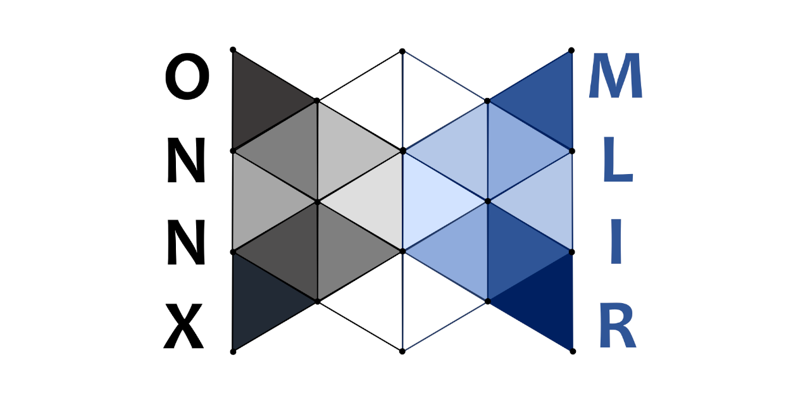

<!--- SPDX-License-Identifier: Apache-2.0 -->
<p align="center"></p>

# ONNX-MLIR-PART

This project provides compiler technology to transform a valid Open Neural Network Exchange (ONNX) graph into code partitions that implements the sub-graphs composing the input ONNX graph with minimum runtime support.
This project is forked from the ONNX-MLIR(https://github.com/onnx/onnx-mlir)  project that implements the [ONNX standard](https://github.com/onnx/onnx#readme) and is based on the underlying [LLVM/MLIR](https://mlir.llvm.org) compiler technology.

| System        | Build Status | Model Zoo Status |
|---------------|--------------|------------------|
| s390x-Linux   | [](https://www.onnxmlir.xyz/jenkins/job/ONNX-MLIR-Pipeline-Docker-Build/) | [](https://www.onnxmlir.xyz/jenkins/job/ONNX-MLIR-Pipeline-Docker-Build/Model_20Zoo_20Report/) |
| ppc64le-Linux | [](https://www.onnxmlir.xyz/jenkinp/job/ONNX-MLIR-Pipeline-Docker-Build/) | [](https://www.onnxmlir.xyz/jenkinp/job/ONNX-MLIR-Pipeline-Docker-Build/Model_20Zoo_20Report/) |
| amd64-Linux   | [](https://www.onnxmlir.xyz/jenkinx/job/ONNX-MLIR-Pipeline-Docker-Build/) | [](https://www.onnxmlir.xyz/jenkinx/job/ONNX-MLIR-Pipeline-Docker-Build/Model_20Zoo_20Report/) |
| amd64-Windows | [](https://dev.azure.com/onnx-pipelines/onnx/_build/latest?definitionId=9&branchName=main) | |
| amd64-macOS   | [](https://github.com/onnx/onnx-mlir/actions/workflows/macos-amd64-build.yml) |
| | [](https://bestpractices.coreinfrastructure.org/projects/5549) |


## Setting up ONNX-MLIR directly

ONNX-MLIR runs natively on Linux, OSX, and Windows.
Detailed instructions are provided below.

### Prerequisites

<!-- Keep list below in sync with docs/Prerequisite.md. -->
```
python >= 3.8
gcc >= 6.4
protobuf >= 4.21.12
cmake >= 3.13.4
make >= 4.2.1 or ninja >= 1.10.2
java >= 1.11 (optional)
```

All the `PyPi` package dependencies and their appropriate versions are captured in [requirements.txt](requirements.txt).

Look [here](docs/Prerequisite.md) for help to set up the prerequisite software.

At any point in time, ONNX-MLIR-PART depends on a specific commit of the LLVM project that has been shown to work with the project.
Periodically the maintainers need to move to a more recent LLVM level.
Among other things, this requires to update the LLVM commit string in [clone-mlir.sh](utils/clone-mlir.sh).
When updating ONNX-MLIR-PART, it is good practice to check that the commit string of the MLIR/LLVM is the same as the one listed in that file. See instructions [here](docs/BuildONNX.md) when third-party ONNX also need to be updated.

### Build

Directions to install MLIR and ONNX-MLIR are dependent on your OS.
* [Linux or OSX](docs/BuildOnLinuxOSX.md).
* [Windows](docs/BuildOnWindows.md).

After installation, an `onnx-mlir-part` executable should appear in the `build/Debug/bin` or `build/Release/bin` directory.

[//]: # (If you have difficulties building, rebuilding, or testing `onnx-mlir-part`, check this [page]&#40;docs/TestingHighLevel.md&#41; for helpful hints.)


## Using ONNX-MLIR-PART

The usage of `onnx-mlir-part` is as such:

```
OVERVIEW: ONNX-MLIR modular optimizer driver

USAGE: onnx-mlir-part [options] <input file>

OPTIONS:

Generic Options:

  --help        - Display available options (--help-hidden for more)
  --help-list   - Display list of available options (--help-list-hidden for more)
  --version     - Display the version of this program

ONNX-MLIR-PART Options:
These are frontend options.

  Partitioning information:
      -- partition-plan - The name of the file specifying the partitions of the input onnx model. 
  
  Choose target to emit:
      --device-config - The name of the file specifying the output format (ONNX, MLIR, LLVM IR, object file, shared library, jar file) for each target device
      --EmitONNXBasic - Ingest ONNX and emit the basic ONNX operations without inferred shapes.
      --EmitONNXIR    - Ingest ONNX and emit corresponding ONNX dialect.
      --EmitMLIR      - Lower the input to MLIR built-in transformation dialect.
      --EmitLLVMIR    - Lower the input to LLVM IR (LLVM MLIR dialect).
      --EmitObj       - Compile the input to an object file.
      --EmitLib       - Compile and link the input into a shared library (default).
      --EmitJNI       - Compile the input to a jar file.

  Optimization levels:
      --O0           - Optimization level 0 (default).
      --O1           - Optimization level 1.
      --O2           - Optimization level 2.
      --O3           - Optimization level 3.
```

The full list of options is given by the `-help` option.
The `-` and the `--` prefix for flags can be used interchangeably.
Note that just as most compilers, the default optimization level is `-O0`.
We recommend using `-O3` for most applications.

Options are also read from the `ONNX_MLIR_FLAGS` environment variable. For example, `ONNX_MLIR_FLAGS="-O3"` will ensure `-O3` for all compilations.

### Simple Example

For example, use the following command to lower an ONNX model (e.g., add.onnx) to a single object file, and partitioned object files and a scheduling code (main.cpp) saved in an output filder (outdir):
```shell
./onnx-mlir-part -O3 -EmitObj -o outputName -emit-folder=outdir -device-cfg=DeviceConfig.yaml -partition-plan=PartitionPlan.yaml add.onnx
```
To generate an initial PartitionPlan of an input ONNX file, 
```shell
./onnx-mlir-part add.onnx
```

Examples of DeviceConfig.yaml and PartitionPlan.yaml are found [here](examples/partition/DeviceConfig.yaml) and [here](examples/partition/PartitionPlan.yaml).


[//]: # ()
[//]: # (The output should look like:)

[//]: # (```mlir)

[//]: # (module {)

[//]: # (  func.func @main_graph&#40;%arg0: tensor<10x10x10xf32>, %arg1: tensor<10x10x10xf32>&#41; -> tensor<10x10x10xf32> {)

[//]: # (    %0 = "onnx.Add"&#40;%arg0, %arg1&#41; : &#40;tensor<10x10x10xf32>, tensor<10x10x10xf32>&#41; -> tensor<10x10x10xf32>)

[//]: # (    return %0 : tensor<10x10x10xf32>)

[//]: # (  })

[//]: # (})

[//]: # (```)

[//]: # (An example based on the add operation is found [here]&#40;docs/doc_example&#41;, which build an ONNX model using a python script, and then provide a main program to load the model's value, compute, and print the models output.)

### Writing a driver to perform inferences: end to end example

An end to end example is provided [here](docs/mnist_example/README.md), which train, compile, and execute a simple MNIST example using our
C/C++, Python, or Java interface.

## Documentation

Documentation is provided in the `docs` sub-directory; the [DocumentList](docs/DocumentList.md) page provides an organized list of documents. 

[//]: # (Information is also provided on our public facing)
[onnx.ai/onnx-mlir](https://onnx.ai/onnx-mlir/) pages.

## Contributing

[//]: # ()
[//]: # (We are welcoming contributions from the community.)

[//]: # (Please consult the [CONTRIBUTING]&#40;CONTRIBUTING.md&#41; page for help on how to proceed.)

[//]: # ()
[//]: # (ONNX-MLIR requires committers to sign their code using the [Developer Certificate of Origin &#40;DCO&#41;]&#40;https://developercertificate.org&#41;.)

[//]: # (Practically, each `git commit` needs to be signed, see [here]&#40;docs/Workflow.md#step-7-commit--push&#41; for specific instructions.)

## Code of Conduct

[//]: # (The ONNX-MLIR code of conduct is described at https://onnx.ai/codeofconduct.html.)

## Projects related/using onnx-mlir-part

[//]: # (* The [onnx-mlir-serving]&#40;https://github.com/IBM/onnx-mlir-serving&#41; project implements a GRPC server written with C++ to serve onnx-mlir compiled models. Benefiting from C++ implementation, ONNX Serving has very low latency overhead and high throughput.)
